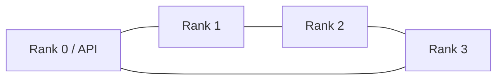

# DeepSeek V4.1 Flash on four DGX Sparks — switchless Ring

[中文](profiles/ring-1m/README.zh-CN.md) · [Deploy](profiles/ring-1m/README.md) · [Measured results](profiles/ring-1m/results/README.md) · [Attribution](NOTICE.md)

A community deployment profile for **four 128 GB DGX Sparks in a physical 200G Ring**, serving the full DeepSeek V4.1 Flash checkpoint with vLLM TP4, SSD Engram and DSpark.

This is a fork of [Tech2Wild / Kai's work](https://github.com/tonyd2wild/DeepSeek-V4.1-Flash-vLLM-DGX-Spark). Their patches, benchmarks and Git history are retained; [their original README](UPSTREAM_README.md) describes their system. **Our configuration and measurements live under `profiles/ring-1m/`.**

## What this profile contributes

- **1,048,576-token context limit**, six scheduled requests, thinking **ON / max** by default.
- **16 GiB KV per node**, with **4,909,644 logical token slots** reported for the whole TP4 instance. Current cache is `fp8_ds_mla` and FP8 indexer.
- A DeepSeek-specific indexer workspace bound saving a theoretical **4.38 GiB per node**, without changing KV arithmetic or precision.
- Full-file, global-row Engram ownership retained while porting upstream graph prestaging to the pinned official vLLM image.
- Reproducible max-thinking checks for tools, generated image recognition, six independent coding requests and long-context retrieval.
- Pinned runtime sources, patch hashes, checkpoint shard hashes, parameterized configuration and explicit benchmark accounting.

## Current evidence

**All four long-input retrieval cases passed.** See [the full table](profiles/ring-1m/results/README.md).

### 实测速度 / Measured prefill and decode

**Thinking ON · effort max · temperature 1.0 · top_p 0.95 · FP8 KV.** The following are single-request long-input retrieval measurements. Decode includes thinking tokens and is measured after the first token; prefill comes from server timing counters. Output allowances are not actual generated output lengths.

| 实际输入 / Input tokens | 实际输出 / Output tokens | 输出预算 / Output allowance | 首 token / TTFT (s) | Prefill (token/s) | Decode (token/s) | 验收 / Check |
|---|---:|---:|---:|---:|---:|---|
| 65,254 | 204 | 262,144 | 59.17 | 1105.77 | 64.30 | PASS |
| 261,832 | 199 | 262,144 | 248.87 | 1054.47 | 66.59 | PASS |
| 784,046 | 201 | 262,144 | 912.30 | 861.01 | 63.77 | PASS |
| 982,126 | 160 | 65,536 | 1214.02 | 810.36 | 60.54 | PASS |

### 六路吞吐 / Six-request throughput

| 测量口径 / Measurement | Output token/s |
|---|---:|
| 整批平均，含最后少数任务收尾 / Whole draining batch | **75.22** |
| 六路同时生成的完整采样区间 / Continuous six-active interval | **100.50** |

Six mixed coding requests produced **13,551 output tokens** at **75.22 token/s** over the entire draining batch. The measured interval with all six active produced **100.50 token/s**. These include thinking tokens and are not directly comparable to upstream's OFF/temperature-0 benchmarks. We make no throughput-superiority claim.

Additional upstream coding-prompt check, still **ON/max**: C1 batch **57.88 token/s**; C6 batch **118.82 token/s**, with **135.06 token/s** during the continuous six-active interval. This is one batch per concurrency, with different thinking/sampling/output lengths from upstream; see [conditions and raw results](profiles/ring-1m/results/README.md#same-coding-prompt-still-onmax).

**Six scheduled requests do not mean six full 1M contexts fit at once.** The logical pool holds about 4.68 × the configured maximum context. Long tests are sequential retrieval checks; output budgets are not measured generated lengths. The current profile keeps FP8 and does not include experimental FP4 kernels.

Each node keeps weights and Engram on local NVMe. A separate management network handles SSH and rendezvous. See the [deployment guide](profiles/ring-1m/README.md) before choosing interface names or launching containers.

## License

MIT for the original repository and our recipe additions; modified vLLM files keep Apache-2.0. NVIDIA and downloaded dependencies retain their licenses. See [NOTICE.md](NOTICE.md). No weights, container images, credentials or private deployment logs are published. This project is not affiliated with or endorsed by DeepSeek, NVIDIA, vLLM or FlashInfer.

**开源万岁！**
